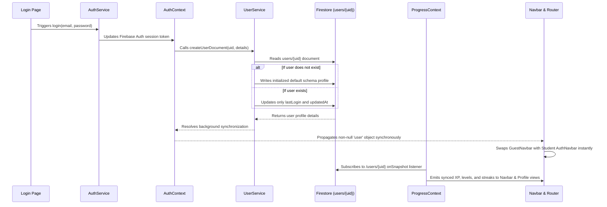
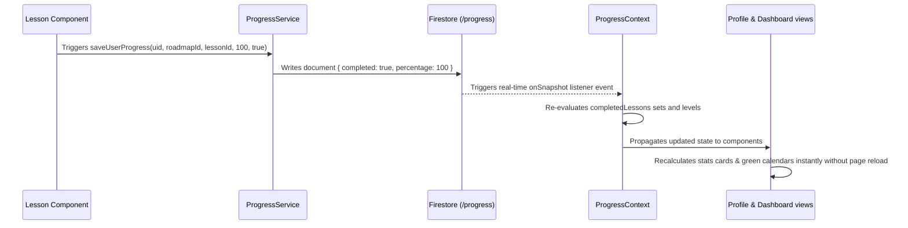

# System Data Flow Specification

This document models the sequence of data transfers and state transitions inside the platform.

---

## 🔑 1. Authentication & Profile Synchronization Flow

---

## ⏱️ 2. Real-Time Lesson Progress Flow

